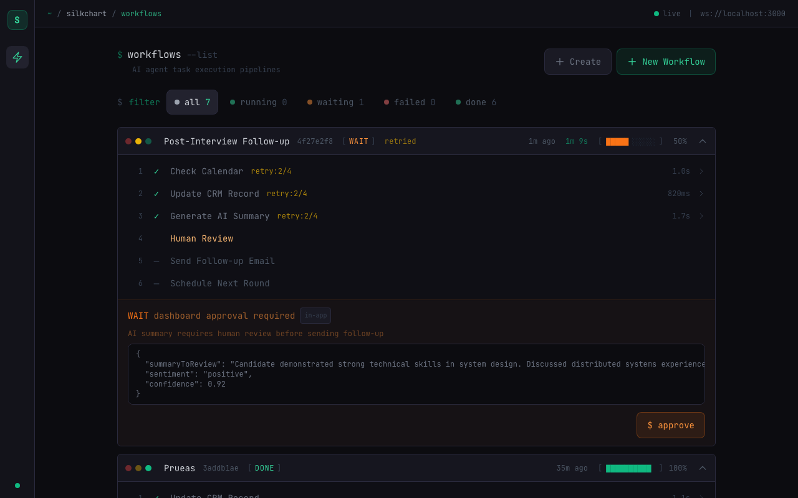

# SilkChart Workflow Engine

Crash-resilient workflow engine for AI agent task execution. Survives process crashes and resumes without re-executing completed steps.

Built with NestJS + SQLite (WAL mode) + React + WebSocket.



## Prerequisites

- **Node.js** >= 18 (tested on v22)
- **npm** >= 9
- No database setup needed — SQLite is embedded via `better-sqlite3` (compiled on `npm install`)
- No environment variables needed — everything works with defaults
- No Docker required

## Quick Start

```bash
git clone git@github.com:simealdana/agent-queue-system.git
cd agent-queue-system

# Install root + backend + frontend dependencies
npm install && npm run install:all

# Start backend (port 3000) and frontend (port 5173) with hot-reload
npm run dev
```

Open http://localhost:5173 — click **New Workflow** to create a pipeline and watch steps execute in real-time.

> **Migrations run automatically** on startup. The backend creates `data/silkchart.db` and applies all schema migrations via the `MigrationRunner` in `DatabaseModule.onModuleInit()`. No manual migration step needed.

### Run Tests

```bash
cd backend && npm test    # 15 tests, ~5s
```

Tests use an isolated in-memory database — they don't touch the dev database.

### Trigger a Workflow via API

```bash
curl -X POST http://localhost:3000/api/workflows/run \
  -H "Content-Type: application/json" \
  -d '{"name": "Post-Interview Follow-up", "template": "default"}'
```

The workflow appears live in the frontend via WebSocket — no refresh needed.

### Project Structure

```
agent-queue-system/
├── backend/          # NestJS API + workflow engine
│   ├── src/
│   │   ├── database/     # SQLite connection, migrations
│   │   ├── workflow/      # Service, repository, controllers, gateway
│   │   ├── steps/         # Step handlers (plugin system)
│   │   └── shared/        # Utils (backoff, sleep)
│   └── test/             # E2E tests
├── frontend/         # React + Vite
│   └── src/
│       ├── components/   # UI components
│       ├── pages/        # Route pages
│       ├── hooks/        # React Query + WebSocket hooks
│       └── api/          # API client
├── docs/             # Test cases, improvement proposals
└── package.json      # Root: runs both backend + frontend
```

## Architecture

```
┌─────────────────┐    WebSocket     ┌──────────────────────┐
│   React + RQ    │◄────────────────►│       NestJS          │
│   (Vite)        │    REST API      │   Workflow Engine      │
└─────────────────┘◄────────────────►│                        │
                                     │  ┌──────────────────┐  │
                                     │  │  StepRegistry     │  │
                                     │  │  (plugin system)  │  │
                                     │  └──────┬───────────┘  │
                                     │         │              │
                                     │  ┌──────▼───────────┐  │
                                     │  │  SQLite WAL       │  │
                                     │  │  (crash-safe txn) │  │
                                     │  └──────────────────┘  │
                                     └────────────────────────┘
```

### Why SQLite with WAL mode instead of a JSON file?

The assignment allows a JSON file, but SQLite with WAL gives us **atomic transactions** — the core durability guarantee. The method `completeStep()` marks the step as completed AND advances `workflow.current_step` in a single synchronous transaction. If the process crashes mid-transaction, neither write persists. This is impossible to guarantee with JSON file writes.

### Why a plugin-based step system?

Each step handler is a pure async function `(StepContext) → StepResult`. New steps are added by registering a function — no changes to the engine. Step handlers opt-in to retryability by throwing `TransientError`; any other error is fatal and stops the workflow immediately. This is safer than the inverse pattern where unknown errors might retry forever.

## Data Model

### `workflows` table

| Column | Type | Purpose |
|--------|------|---------|
| `id` | TEXT PK | UUIDv4 |
| `name` | TEXT | Human-readable label |
| `status` | TEXT | `pending` → `running` → `completed` / `failed` / `waiting` |
| `current_step` | INTEGER | **Resume pointer** — next step to execute |
| `total_steps` | INTEGER | For progress calculation |
| `context` | TEXT (JSON) | Accumulated output from all completed steps |
| `error` | TEXT | Error message if failed |

### `workflow_steps` table

| Column | Type | Purpose |
|--------|------|---------|
| `id` | TEXT PK | UUIDv4 |
| `workflow_id` | TEXT FK | Parent workflow (CASCADE delete) |
| `step_index` | INTEGER | Execution order (UNIQUE with workflow_id) |
| `name` | TEXT | Step handler name |
| `status` | TEXT | `pending` → `running` → `completed` / `failed` / `waiting` |
| `result` | TEXT (JSON) | Step output data |
| `attempt` | INTEGER | Current retry attempt |
| `max_retries` | INTEGER | Max retry budget |
| `duration_ms` | INTEGER | Wall-clock execution time |

### Why this structure

**`current_step` as a resume pointer.** After a crash, the engine reads `current_step` and starts from there. Steps before that index are guaranteed completed because `completeStep()` advances `current_step` in the same atomic transaction that marks the step done.

**`context` as accumulated JSON.** Each step reads prior outputs and writes its own. Stored on the workflow row so resume is O(1) — no need to scan all steps to reconstruct state. The `AccumulatedContext` type maps each step name to its known output shape for compile-time safety.

**Per-step `attempt` + `max_retries`.** Retry budget is tracked per step. Transient failures retry with exponential backoff + jitter (`min(30s, 500ms × 2^attempt) × random`) without affecting other steps.

## Error Handling

| Error Type | Behavior |
|-----------|----------|
| `TransientError` | Retry with exponential backoff + full jitter. Up to `max_retries` attempts. |
| `WaitForApproval` | Pause workflow. Dashboard approval or external link (token-based). |
| Any other `Error` | Fatal. Stop immediately, mark workflow as failed. Resumable. |

## Testing

15 tests across 8 categories — see [docs/test-cases.md](docs/test-cases.md) for detailed test specifications.

| Category | Tests | What it proves |
|----------|-------|----------------|
| Resume after crash | 1 | Completed steps are never re-executed |
| Transient retry | 2 | Exponential backoff works, retries exhaust correctly |
| Fatal error | 1 | Non-transient errors stop immediately, no retry |
| Dashboard approval | 2 | Workflow pauses and resumes after human approval |
| External approval | 3 | Token generation, token-based approval, invalid token rejection |
| Restart from scratch | 2 | Full reset + re-execution, context cleared |
| Context accumulation | 1 | Each step receives all prior outputs |
| Migration runner | 3 | Schema versioning, idempotency, rollback |

## API

| Method | Endpoint | Description |
|--------|----------|-------------|
| `POST` | `/api/workflows` | Create workflow (stays pending) |
| `POST` | `/api/workflows/run` | Create and start in one call |
| `GET` | `/api/workflows` | List all workflows with steps |
| `GET` | `/api/workflows/:id` | Get single workflow |
| `POST` | `/api/workflows/:id/start` | Start a pending workflow |
| `POST` | `/api/workflows/:id/resume` | Resume a failed workflow |
| `POST` | `/api/workflows/:id/restart` | Re-run from scratch |
| `POST` | `/api/workflows/:id/approve` | Approve waiting step |
| `GET` | `/api/steps` | List available step handlers |

All POST/PUT endpoints validate input with `class-validator`. WebSocket pushes `workflow:update` events for real-time UI updates.

## Tech Stack

| Layer | Choice | Why |
|-------|--------|-----|
| Backend | NestJS + TypeScript | Decorator-based DI, module system, lifecycle hooks for crash recovery |
| Database | better-sqlite3 (WAL) | Synchronous atomic transactions — the crash-safety primitive |
| Frontend | React 18 + Vite | Fast HMR, minimal config |
| Server state | TanStack React Query | Cache invalidation on WebSocket events |
| Real-time | socket.io | Bidirectional, auto-reconnect |
| Styling | Tailwind CSS | Utility-first, terminal/dev-tool aesthetic |

## What I'd Add With More Time

Prioritized by impact for a live-interview AI agent system:

### Critical for production

- **Step timeout with cancellation.** A step calling an LLM or external API could hang indefinitely. During a live interview, a stuck workflow blocks the entire candidate experience. Each step needs a configurable deadline (e.g., 30s for LLM inference, 10s for CRM updates) that kills the step and either retries or fails based on the error type. Additionally, there's no way to cancel a running workflow — if an interview ends early, the agent keeps executing steps against a stale context.

- **Idempotency keys for external side effects.** When retrying a `send-followup` step that calls SendGrid, the current implementation will send duplicate emails. The fix is passing a deterministic idempotency key (e.g., `{workflowId}:{stepName}:{attempt}`) to every external API call. Without this, transient retries can cause real-world duplicates — a candidate receiving the same follow-up email three times.

- **Conditional branching (DAG execution).** Steps are strictly sequential. In practice, "check calendar" and "update CRM" are independent and could run in parallel. More importantly, some steps should be conditional: if the AI summary has low confidence, skip the auto-followup and route to human review instead. This requires modeling the step graph as a DAG with conditional edges rather than a flat array.

### Important for operations

- **Structured observability.** No metrics, no structured logging, no distributed tracing. In production you need: step duration histograms (to detect LLM latency regressions), retry rate by step (to identify flaky integrations), and workflow completion rate by template. Prometheus + Grafana or OpenTelemetry, depending on the existing infrastructure.

- **Webhook notifications.** External systems (Slack, ATS platforms) need to know when a workflow completes or fails. Currently the only notification channel is the WebSocket, which requires an active browser session. A webhook system with configurable URLs per event type would enable integration with any external tool.

### Necessary for multi-tenancy

- **Authentication and workflow ownership.** No auth layer exists. In production, each recruiter or hiring team would own their workflows. JWT-based auth with RBAC (role-based access control) to prevent one team from viewing or modifying another's workflows. This also enables per-tenant rate limiting and audit trails.
